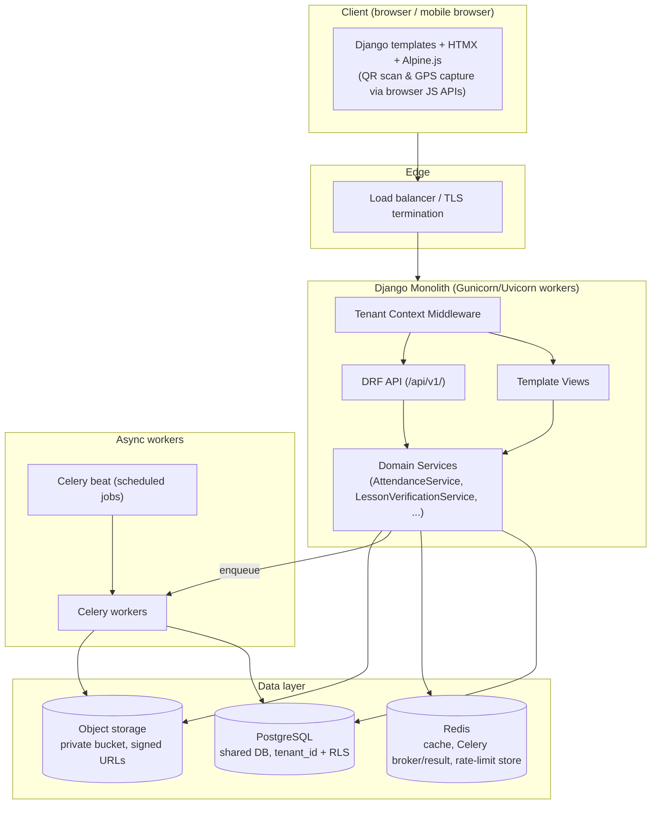
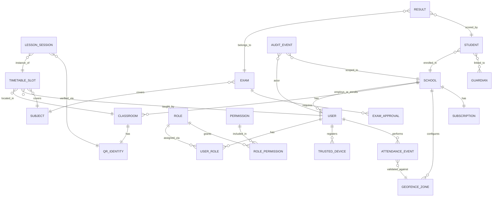
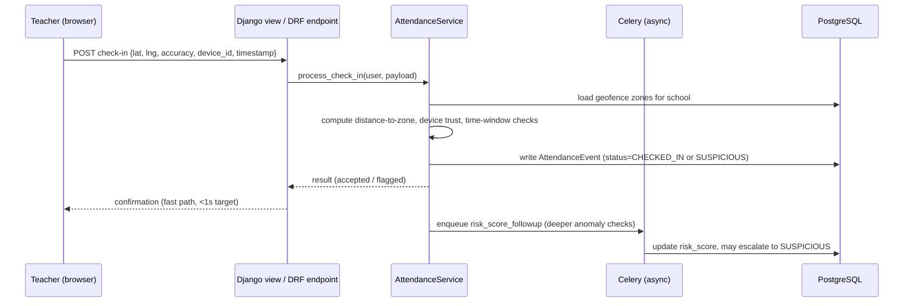
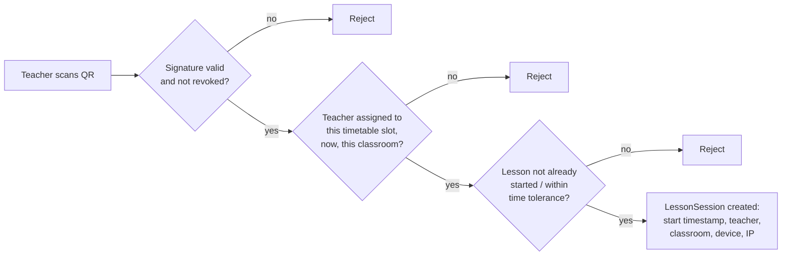

# SchoolOS — Phase 0 Architecture Overview

Status: **DRAFT — awaiting approval before any implementation begins.**
Stack (confirmed by product owner): **Django, PostgreSQL, Django REST Framework, Celery, Redis, Django templates.** No separate SPA frontend (Next.js/React dropped).

---

## 1. Executive Summary

SchoolOS is a multi-tenant Django monolith serving many independent schools ("tenants") from one deployment. The two features that make this more than CRUD are:

1. **Teacher attendance verification** — proving physical presence (GPS + geofence + device trust + risk scoring), not just recording a button press.
2. **Lesson verification** — proving a scheduled lesson actually happened, via classroom QR identities validated server-side against the timetable.

Everything else (academics, exams, communication, tenant management) is deliberately conventional so effort concentrates on the two hard, differentiating problems and on tenant isolation, which is a correctness and trust requirement, not a nice-to-have.

Architecture style: **modular monolith**. One Django project, one deployable unit, apps organized by domain with enforced boundaries (no cross-app model imports outside declared service interfaces). Services can be extracted later if a specific domain (e.g. attendance event ingestion) needs independent scaling — nothing here blocks that, nothing here requires it on day one.

---

## 2. Where I'm pushing back on the original spec

Per the brief's own instruction ("challenge bad requirements, don't blindly follow"), three things in the source document are worth calling out before building:

- **Django Channels/WebSockets** — the original spec lists this as backend tech. You didn't include it in your confirmed stack, and I agree with the omission for now: "live" dashboard numbers (present/absent counts, lesson status) are acceptable at 10–30s staleness for a school context. **Recommendation:** HTMX polling (`hx-trigger="every 15s"`) against cached DRF/template endpoints. Revisit Channels only if a real use case demands sub-second push (e.g. a security-response live feed) — adding it later is additive, not a rewrite.
- **Biometric/liveness verification** — the spec lists this as a "future" signal. Flagging early: this is a legal/privacy escalation (biometric data triggers stricter data-protection obligations in most jurisdictions, including Uganda's Data Protection and Privacy Act). **Recommendation:** explicitly out of scope until there's a named legal basis and consent flow; the architecture must not assume it (see §9 — risk scoring is designed to hit useful confidence without it).
- **WebAuthn/passkeys for teachers** — good security primitive, but shared/low-end Android devices and low technical literacy (stated as a target constraint) make passkeys a rough first-login experience. **Recommendation:** MFA via TOTP or SMS-OTP for MVP; keep WebAuthn as an optional upgrade path for admin/platform accounts where devices and literacy are less of a constraint.

None of these are hard blockers — flagging them here so they're a decision, not a default.

---

## 3. System Architecture



**Domain boundary rule:** a Django app may call another app's `services.py` public functions, never another app's models directly. This is the enforcement mechanism for "no giant views, no duplicated business logic" from the spec (§41).

---

## 4. Domain Boundaries (Django apps)

| App | Owns | Notes |
|---|---|---|
| `core` | Base models/mixins (`TenantScopedModel`, `TimeStampedModel`, `SoftDeleteModel`), exceptions, shared utils | No business logic |
| `tenancy` | `School` (tenant), tenant context middleware, tenant resolution, subscription/plan/feature-flag models | Platform's central isolation boundary |
| `accounts` | `User`, account lifecycle (invite → verify → active → suspended), MFA, trusted devices | Auth only, not authorization |
| `rbac` | `Role`, `Permission`, `UserRole`, permission-check backend | Data-driven, not hardcoded role checks |
| `attendance` | Check-in/out, geofence config, risk scoring, suspicious-event flagging | Depends on `accounts`, `tenancy` |
| `lessons` | Classrooms, QR identities, timetable slots, lesson start/end verification | Depends on `academics`, `accounts` |
| `academics` | Academic years, terms, classes, subjects, timetable, enrollment | |
| `examinations` | Exam creation/approval/lock, marks entry, results, publication | Depends on `academics` |
| `communications` | Announcements, messages, notification dispatch, SMS/email provider abstraction | Provider-agnostic interface |
| `content` | School CMS: events, news, gallery, documents, calendar | Tenant-scoped content |
| `audit` | Append-only audit log model + `record_event()` service used by every other app | No app depends on this being mutable |
| `platform_admin` | Platform dashboard, tenant CRUD/suspend/activate, global feature flags, platform-level audit | Explicitly separate from `tenancy`'s per-school surface (spec §32: never mix platform admin with school admin) |
| `api` | DRF router aggregation, versioning (`/api/v1/`), API-only concerns (pagination, throttling classes) | Thin; delegates to each app's services |

---

## 5. Multi-Tenancy Strategy — ADR-001

**Decision: shared database, shared schema, `tenant_id` (FK to `School`) on every tenant-scoped table, enforced by three independent layers.**

### Why not the alternatives
| Strategy | Isolation strength | Cost at scale (thousands of schools) | Migration complexity | Verdict |
|---|---|---|---|---|
| Shared DB + `tenant_id` | Strong, if enforced centrally | Low — one DB, normal indexing | Standard Django migrations | **Chosen** |
| Postgres schema-per-tenant | Very strong | High — thousands of schemas to migrate on every deploy, connection pooling gets harder, cross-tenant platform analytics needs `UNION` across schemas | Every migration must run N times | Rejected for now; revisit only if a specific school demands physical data separation contractually |
| Database-per-tenant | Strongest | Very high — ops burden, connection limits, cost | Highest | Rejected — not justified at this stage |

### Three enforcement layers (defense in depth — this directly answers the spec's "don't rely on developers remembering `.filter(school=...)`")

1. **ORM layer:** `TenantScopedModel` abstract base (in `core`) with a `school` FK. Its default manager reads the current tenant from a request-scoped `contextvar` (set by `TenantContextMiddleware` from `request.user`'s school, or from an explicit platform-admin-selected tenant) and auto-filters every queryset. Accessing all tenants requires an explicit, named, logged escape hatch: `Model.all_tenants.filter(...)`, which is only reachable from `platform_admin` code paths and itself writes an audit event.
2. **Database layer:** PostgreSQL Row-Level Security policies on every tenant table, keyed off `current_setting('app.current_tenant_id')`, set via `SET LOCAL` at the start of each request/transaction. This is the backstop for the case the ORM layer is bypassed by a bug, a raw query, or a future developer who doesn't know the convention — the database itself refuses the row.
3. **Test layer:** a mandatory `tests/test_tenant_isolation.py` per app that creates two schools and asserts every list/detail/API endpoint returns zero cross-tenant data and every write attempt against another tenant's object 403s/404s. CI fails the build if this suite is missing for a new tenant-scoped model (enforced via a management command check, see §19).

Platform admins are **not** implicitly exempt from RLS — a platform admin viewing a specific school's data does so through an explicit "enter tenant" action that sets the session variable deliberately and logs it (spec §8: platform access must be deliberate, logged, permission-controlled).

---

## 6. Database Architecture & ERD

Core entities (abbreviated — full field-level schema comes in Phase 1 per-app design, not before review of this document):



Notes:
- Every entity except `SCHOOL` itself and platform-level tables (`SUBSCRIPTION` plans catalog, platform `AUDIT_EVENT` for platform actions) carries `school_id` and is subject to RLS.
- `AUDIT_EVENT` is append-only: no `UPDATE`/`DELETE` grants for the application's DB role, enforced at the Postgres role level, not just application convention (spec §38/§39).
- UUID primary keys on tenant-facing tables (prevents ID enumeration and cross-tenant ID guessing; spec §60 "don't expose database IDs unnecessarily").

---

## 7. Role & Permission Matrix

**Decision:** custom RBAC (`rbac` app), not bare Django `auth.Permission`, because Django's built-in permissions are global per user and this system needs per-school, per-role, data-driven permissions with future custom roles (bursar, librarian, etc. — spec §9).

Model shape: `Role` (name, is_system_role, school nullable for platform-level roles) → `RolePermission` → `Permission` (codename registry, e.g. `attendance.check_in`) ; `UserRole` links `User × School × Role`. A custom auth backend's `has_perm(user, perm, obj)` resolves through this table scoped to the current tenant context.

| Role | Scope | Representative permissions |
|---|---|---|
| Platform Admin | Platform | `tenant.create/suspend/activate`, `platform.audit.view`, `feature_flag.manage` — **no** implicit `school.*` permissions |
| School Owner | School | `school.configure`, `school_admin.manage`, all School Administrator perms |
| School Administrator | School | `teacher.*`, `student.*`, `class.*`, `attendance.override`, `attendance.approve`, `report.view` |
| DOS / Academic Administrator | School | `timetable.*`, `exam.approve`, `exam.publish`, `result.approve`, `result.publish`, `lesson.view` |
| Teacher | School | `attendance.check_in`, `attendance.check_out`, `lesson.start`, `lesson.end`, `exam.create`, `exam.upload`, `result.create` |
| Student | School (self-scoped) | `attendance.view` (own), `result.view` (own), `assignment.view` |
| Parent/Guardian | School (linked children) | `attendance.view` (linked), `result.view` (linked), `announcement.view` |
| Custom roles (bursar, librarian, nurse, receptionist, HOD, transport, boarding, discipline) | School | Assembled from the same `Permission` registry per school's needs — no code changes required to add a new role |

Fine-grained permissions follow the `domain.action` convention from the spec §10 (`attendance.view`, `attendance.check_in`, `attendance.override`, `attendance.approve`, `lesson.start/end/view`, `exam.create/upload/approve/publish`, `result.create/edit/approve/publish`, `student.create/update/view/archive`, `teacher.create/update/view/suspend`, plus platform-level equivalents).

---

## 8. Authentication Architecture — ADR-002

- Django's auth framework as the base, custom `User` model from day one (`AUTH_USER_MODEL`), email or phone as the login identifier (schools in the target environment may have inconsistent email coverage among teachers — phone+OTP is a realistic primary path).
- **Account lifecycle** exactly as specified: `INVITED → PENDING_VALIDATION → VERIFIED → ACTIVE → SUSPENDED → DEACTIVATED`, modeled as an explicit `status` field with a transition service (`AccountLifecycleService`) — no direct status writes from views, every transition is audited.
- **MFA:** TOTP (authenticator app) where the user has one, SMS-OTP fallback (via the same provider abstraction as §11). Required for School Administrator and above; optional-but-encouraged for Teacher.
- **Sessions:** server-side sessions (Django's default, backed by cache/DB), short-lived signed tokens for the DRF API (JWT or DRF token — recommend `djangorestframework-simplejwt` with short access-token TTL + refresh rotation, since API consumers may include a future native app).
- **Device registration** ties into `accounts.TrustedDevice`: first login from a new device triggers step-up verification (OTP) and is logged; subsequent logins from that device/browser fingerprint are trusted until admin revocation.

---

## 9. Attendance Verification Architecture — ADR-003

Core principle from the spec, preserved: **no single signal is proof.** Attendance check-in produces a **risk score**, not a binary accept/reject, and only clearly-bad scores are auto-rejected; the ambiguous middle is flagged for human review, never silently punished.



**Signals and indicative weights** (configurable per school, not hardcoded — spec §60):

| Signal | Weight | Detail |
|---|---|---|
| GPS accuracy acceptable & inside geofence | 30 | Haversine distance ≤ configured radius per zone |
| Trusted device | 20 | Matches a registered, non-revoked device |
| Expected network signature (optional, school Wi-Fi) | 10 | Best-effort, never sole gate |
| Movement plausibility | 10 | No impossible jump since last known location |
| No anomaly flags | 30 | No mock-location indicator, no repeated-suspicious-coordinate pattern, no accuracy anomaly |

Explicitly **not** implemented in MVP: biometric liveness (see §2). Explicitly implemented: geofence configuration per school (multiple named zones — Staff Room, Main Gate, etc., spec §13), trusted-device management with revocation and event history (spec §15), and the "colleague checks in for me" threat treated as a *detection* problem (device trust + anomaly pattern + audit trail) rather than a false claim of cryptographic proof (spec §16 — this is the correct framing and is preserved).

**States** are explicit, not boolean (spec §21): `NOT_CHECKED_IN, CHECKED_IN, LATE, ON_LEAVE, ABSENT, SUSPICIOUS, CHECKED_OUT`.

**Offline tolerance:** check-in events can be queued client-side (signed local payload with device-generated timestamp + monotonic counter) and synced when connectivity returns; the server is the timestamp authority — a client timestamp is evidence, not truth, and large client/server clock deltas raise the risk score rather than being trusted outright.

---

## 10. QR Lesson Verification Architecture

Every classroom has a durable **QR identity** (`lessons.QRIdentity`, one per classroom, rotatable/revocable). The QR encodes only an opaque classroom identifier + a signature (HMAC, server secret) — never lesson or time data, so a photographed QR from last term doesn't help fake today's lesson.



End follows the same validation, plus a "reasonable duration" check. Historical `LessonSession` timestamps are immutable from ordinary teacher accounts; corrections go through an explicit `LessonCorrectionRequest` workflow requiring DOS/Academic Administrator approval, fully audited (spec §19/§20).

---

## 11. Communication Architecture

`communications` app defines a `NotificationChannel` interface (`send(recipient, message) -> DeliveryResult`) with concrete adapters: `InAppChannel`, `EmailChannel` (SMTP/provider API), `SMSChannel` (provider API, e.g. Africa's Talking or similar — deliberately behind the interface so the provider is a config choice, not a code dependency). All sends go through Celery tasks (never synchronous in the request path) so an SMS provider outage never blocks a request. Delivery attempts and failures are logged for observability (spec §44).

---

## 12. Examination & Results Workflow

Modeled as an explicit state machine on `Exam` (`DRAFT → SUBMITTED → APPROVED/REJECTED → LOCKED`) and `ResultSet` (`ENTERED → SUBMITTED → VERIFIED → APPROVED → PUBLISHED`). Published results are immutable from normal write paths; corrections require a `ResultCorrectionRequest` with authorization + audit record, matching spec §25. Per-tenant configurable grading system (`GradingScheme` model, not hardcoded thresholds) per spec §26.

---

## 13. Threat Model (representative, not exhaustive)

| Threat | Vector | Mitigation |
|---|---|---|
| Cross-tenant data access | Bug, missed filter, IDOR via guessed ID | RLS + ORM auto-scoping + UUID PKs + mandatory isolation tests (§5) |
| Teacher-for-teacher check-in ("buddy punching") | Shared device/phone | Trusted device binding, anomaly/risk scoring, audit trail — detection not false-proof (§9) |
| GPS spoofing | Mock-location apps, spoofed coordinates | Mock-location indicator checks where available, movement plausibility, risk scoring (never sole gate) |
| Photographed/replayed QR | Static QR reused across time/lessons | QR encodes only classroom identity + signature; server validates timetable/time/state, not the QR alone (§10) |
| Result tampering after publication | Compromised or malicious staff account | Immutable published results, correction workflow, append-only audit log with DB-level no-update/delete grant |
| Platform admin over-reach | Convenience access to school data | Explicit "enter tenant" action, logged, distinct from default platform scope (§5, §8) |
| Malicious file upload (exam docs) | Disguised executable, oversized file | Extension + MIME + signature validation, size limits, private object storage, signed download URLs, no public paths (§14) |
| Credential stuffing / brute force | Automated login attempts | Rate limiting (Redis-backed), account lockout with backoff, MFA on privileged roles |
| Session/token theft | XSS, insecure storage | Secure/HttpOnly cookies for template sessions, short-lived rotating JWT for API, CSP headers, template auto-escaping |

---

## 14. Security Architecture

- **Transport:** HTTPS everywhere, HSTS, secure cookies (`SESSION_COOKIE_SECURE`, `CSRF_COOKIE_SECURE`).
- **CSRF:** Django's built-in CSRF protection for template forms/HTMX requests; DRF API uses token/JWT auth (not session), so it's exempt by design but rate-limited and scoped separately.
- **XSS:** Django template auto-escaping (never `|safe` on user input), CSP header via middleware.
- **SQL injection:** ORM by default; any raw SQL goes through parameterized queries only, flagged in code review checklist.
- **Secrets:** environment variables / secret manager, never in Git (`.env` gitignored, `.env.example` committed); startup check fails fast if required secrets are missing.
- **Rate limiting:** Redis-backed (`django-ratelimit` or DRF throttle classes) on auth endpoints and attendance/lesson check endpoints specifically (these are abuse targets).
- **File uploads:** as in §13 — extension/MIME/signature validation, size caps, randomized storage keys, private bucket, signed short-TTL download URLs, permission check before signing.
- **Audit logging:** append-only `AuditEvent` for every action in the spec's §38 list, written via a single `audit.record_event()` service call from within each domain service — never scattered `Model.save()` side effects.

---

## 15. API Architecture

Django templates remain the primary UI (server-rendered + HTMX partials). DRF provides a versioned API (`/api/v1/...`) for the same domain services, primarily to support: (a) future native mobile apps, (b) integrations, (c) HTMX endpoints that want JSON for client-side bits (QR scan result, GPS submit). Views and API viewsets both call the same `services.py` functions — no business logic duplicated between them (spec §41).

```
/api/v1/auth/
/api/v1/tenants/          (platform-scoped)
/api/v1/schools/
/api/v1/teachers/
/api/v1/students/
/api/v1/attendance/
/api/v1/lessons/
/api/v1/exams/
/api/v1/results/
/api/v1/notifications/
```

Serializers never expose raw internal PKs where a UUID/public identifier suffices; pagination mandatory on every list endpoint (spec §52).

---

## 16. Backend Folder Structure

```
metocore/
├── manage.py
├── config/                     # (rename of current metocore/ project package — settings, urls, asgi/wsgi)
│   ├── settings/
│   │   ├── base.py
│   │   ├── dev.py
│   │   └── prod.py
│   ├── urls.py
│   ├── celery.py
│   └── asgi.py / wsgi.py
├── apps/
│   ├── core/
│   ├── tenancy/
│   ├── accounts/
│   ├── rbac/
│   ├── attendance/
│   ├── lessons/
│   ├── academics/
│   ├── examinations/
│   ├── communications/
│   ├── content/
│   ├── audit/
│   └── platform_admin/
│       # each app: models.py, services.py, views.py, api/ (serializers.py, viewsets.py),
│       #           permissions.py, tasks.py, admin.py, tests/
├── templates/                  # base templates + per-app template overrides
├── static/
└── docs/
    ├── architecture/
    └── adr/
```

Note: this proposes renaming the existing `metocore/` settings package to `config/` to avoid the project-name/app-name collision that gets confusing once `apps/` exists — a mechanical, low-risk change, called out here rather than done silently.

---

## 17. Infrastructure & Deployment Architecture — ADR-004 (storage)

- **App servers:** containerized Django (Gunicorn), behind a load balancer/TLS termination. Stateless — no local file storage.
- **Database:** managed PostgreSQL (automated backups, point-in-time recovery available).
- **Cache/broker:** managed Redis — cache, Celery broker + result backend, rate-limit counters.
- **Object storage:** S3-compatible private bucket for exam documents, uploads, gallery content — never served directly; signed URLs only.
- **Static assets:** collected + served via CDN/whitenoise depending on host.
- Environment separation: dev / staging / production, staging as a required gate before production deploys (spec §46).

---

## 18. CI/CD Architecture

GitHub Actions pipeline, matching spec §46:

```
push → lint (ruff/flake8) → type check (mypy, optional) → unit tests → integration tests
     → tenant-isolation tests (mandatory gate, see §5) → security checks (bandit / pip-audit)
     → build → deploy staging → smoke tests → manual production approval → deploy
```

No path from a failing pipeline to production. Migrations run as an explicit, reviewed deploy step, never implicit.

---

## 19. Testing Strategy

- **Unit tests:** business rules inside `services.py`, isolated from Django request/response cycle where possible.
- **Integration tests:** service + database, using real Postgres (not sqlite) so RLS and constraints are actually exercised.
- **API tests:** DRF `APIClient`, covering auth and permission boundaries per endpoint.
- **Tenant isolation tests:** mandatory per tenant-scoped app, per §5 — a CI check (management command `check_tenant_isolation_coverage`) fails the build if a new `TenantScopedModel` subclass ships without a corresponding isolation test.
- **Security tests:** the explicit attack list from the spec (§43) — cross-tenant API access, role-escalation attempts, suspended-user access, expired/tampered tokens, tampered/old/wrong-classroom QR, out-of-geofence GPS, duplicate check-in — each as a named test case, not left implicit.
- **E2E tests:** Playwright, covering the golden path (create school → create teacher → activate → login → check in → start lesson → end lesson → admin sees result).
- Coverage target 80%+ as a CI gate, weighted toward the above categories rather than incidental line coverage.

---

## 20. Backup & Disaster Recovery Strategy

- Automated daily encrypted PostgreSQL backups, off-site, with a defined retention window (recommend: 30 daily, 12 monthly).
- **Restore testing is a scheduled exercise, not a one-time setup step** — a monthly automated restore-to-scratch-environment job that verifies backup integrity, per the spec's explicit point that an untested backup isn't a DR strategy.
- Documented RPO/RTO targets to be set with you before Phase 1 sign-off (this is a business decision, not purely technical — e.g. "max 24h data loss, max 4h to restore service" vs tighter, has cost implications).

---

## 21. Observability Strategy

- Structured JSON logging (request ID, tenant ID, user ID on every log line).
- `/health/` (process liveness) and `/readiness/` (DB/Redis reachability) endpoints.
- Metrics: API latency, error rate, DB latency, Celery queue depth/failures, auth failure rate, attendance rejection rate (a spike here is itself a signal worth watching).
- Error monitoring via an APM/error-tracking service (e.g. Sentry) — not building this in-house.

---

## 22. Development Roadmap (Django-only, adapted from spec §56)

| Phase | Deliverable |
|---|---|
| 0 | This document, ERD, permission matrix, threat model — **you are here** |
| 1 | Foundation: Django project restructure (`config/` + `apps/`), Postgres, Redis, Celery wiring, `accounts`, `rbac`, `tenancy` + middleware + RLS, `audit`, base template system |
| 2 | Tenant management: `platform_admin` dashboard, tenant CRUD/suspend/activate, feature flags |
| 3 | Teacher attendance (first MVP milestone): geofence config, check-in/out, device trust, risk scoring, attendance dashboard |
| 4 | Lesson verification: classrooms, QR identities, timetable, lesson start/end |
| 5 | Communication: announcements, notifications, SMS/email abstraction |
| 6 | Academics: years/terms/classes/subjects/enrollment/timetable |
| 7 | Examinations: creation → approval → locking → marks → results → publication |
| 8 | Student/Parent portals |
| 9+ | Advanced modules (finance, library, transport, etc.) and intelligence/analytics — explicitly deferred, not scoped now |

---

## 23. MVP Definition

Phases 0–4 constitute the MVP: a school can onboard, teachers can be verifiably present and verifiably deliver lessons, and administrators can see it on a dashboard. Everything academic/examination/communication is valuable but not what makes this product different from a spreadsheet — attendance and lesson verification are.

---

## 24. Future Scalability Strategy

The modular monolith's app boundaries (§4, enforced via services-only cross-app calls) are the extraction seams if/when scale demands it — e.g. `attendance` could become an independently-scaled ingestion service if check-in volume ever justifies it, without a rewrite, because it never depended on another app's models directly. Not building this now; keeping the door open.

---

## 25. Major Architectural Risks

1. **RLS + ORM auto-scoping is a novel pattern for whoever maintains this later** — mitigated by the mandatory isolation-test gate (§5, §19), not just documentation.
2. **Risk-scoring thresholds will need real-world tuning** — ship with conservative defaults that favor flagging-for-review over auto-rejection, adjust from actual false-positive/negative data after MVP.
3. **SMS provider cost/reliability in-region** — provider abstraction (§11) limits blast radius of a bad choice, but provider selection itself needs local research before Phase 5.
4. **Low-end device / low-bandwidth performance of GPS+QR camera flows** — needs real device testing early (Phase 3–4), not assumed from desktop development.

---

## 26. ADR Index

- **ADR-001** — Multi-tenancy strategy: shared DB + `tenant_id` + RLS + ORM scoping (§5)
- **ADR-002** — Authentication architecture: session + JWT hybrid, TOTP/SMS-OTP MFA (§8)
- **ADR-003** — Attendance verification: multi-signal risk scoring, no single-signal proof (§9)
- **ADR-004** — Storage architecture: private object storage + signed URLs (§17)
- **ADR-005** — Modular monolith: domain-bounded Django apps, service-layer-only cross-app calls (§3–§4)

Full ADR documents to be written as separate files under `docs/adr/` once this overview is approved (avoids documenting decisions before they're confirmed).

---

## 27. Decisions needing your explicit approval before Phase 1 starts

1. Multi-tenancy: shared DB + tenant_id + Postgres RLS (§5) — or do you want schema-per-tenant despite the migration/ops cost?
2. Dropping Django Channels/WebSockets from MVP in favor of HTMX polling (§2) — agree?
3. Dropping biometric liveness from scope entirely pending a legal basis (§2) — agree?
4. MFA approach: TOTP + SMS-OTP, WebAuthn deferred (§2, §8) — agree?
5. Renaming `metocore/` settings package to `config/` and introducing `apps/` (§16) — OK to do this restructure in Phase 1?
6. RPO/RTO targets for backups (§20) — need your input, this is a cost/risk tradeoff only you can set.
7. SMS provider — no recommendation yet, needs regional research before Phase 5; flagging now so it's not forgotten.
8. Internal Developer Platform scope (§28) — docker-compose + golden-path app scaffolding for Phase 1, PR preview environments deferred to Phase 2+ — agree, or do you want preview environments from day one?

---

## 28. Internal Developer Platform (IDP)

This is developer-experience infrastructure — getting a new engineer's laptop to "can build and test a feature" quickly, and later, provisioning review environments — distinct from the production infra in §17/§20/§21. Scoped deliberately small for a single modular monolith, not a multi-service platform-engineering effort; it grows only if/when apps get extracted per §24.

| Component | What it does | Why now / why not |
|---|---|---|
| **One-command local env** | `docker-compose.yml` bundling Postgres, Redis, Django, Celery worker, Celery beat, and an email-capture tool (e.g. Mailhog); `Makefile` targets (`make dev`, `make test`, `make migrate`, `make seed`) wrapping common commands | Removes "works on my machine" setup friction from day one — cheap, no reason to defer |
| **Golden-path app scaffolding** | A management command (e.g. `manage.py startdomainapp <name>`) that generates a new domain app already wired with `TenantScopedModel`, `services.py`, `tests/test_tenant_isolation.py` stub, and an `api/` skeleton | Makes the §4/§5 conventions (service-layer boundaries, mandatory isolation tests) the path of least resistance instead of something a developer has to remember and get right by hand every time |
| **Seed/demo-tenant fixtures** | A management command that creates 2+ demo schools with representative users/data | Needed anyway for the tenant-isolation tests (§5, §19) and manual QA; reused by local env and previews |
| **Ephemeral PR preview environments** | Each PR spins up a short-lived containerized environment seeded with demo-tenant fixtures, torn down on merge/close | Lets reviewers/QA click through a change instead of reading a diff; catches integration issues before staging — **proposed for Phase 2+, not Phase 1**, since it needs CI infra that doesn't exist yet |
| **Centralized docs site** | Publish this `docs/` tree (architecture, ADRs, per-domain docs from spec §48) via a static docs generator (e.g. MkDocs) rather than leaving it as raw markdown in the repo | Onboarding shouldn't require knowing the file layout; low effort once `docs/` has real content |
| **Service/app catalog (Backstage-style)** | Not built | Explicitly **not justified yet** — one deployable, ~12 domain apps, no polyglot services to catalog. Revisit only if §24's extraction actually happens |
| **Secrets/config** | Local dev: `.env` + `.env.example` (§14). Shared dev/staging: whatever secret manager the host platform provides (§17) | The IDP's job here is documenting the one place secrets live, not building a new tool |

Explicitly out of scope for now (would be premature per YAGNI): a custom internal portal UI, self-service Kubernetes namespace provisioning, multi-cluster tooling — none of that is earned by a single Django monolith yet.
